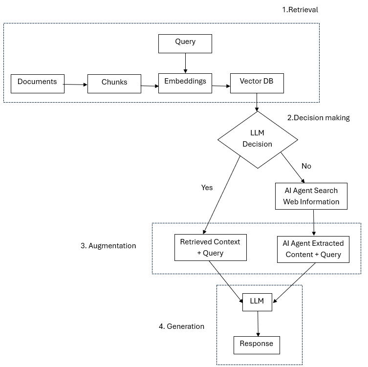
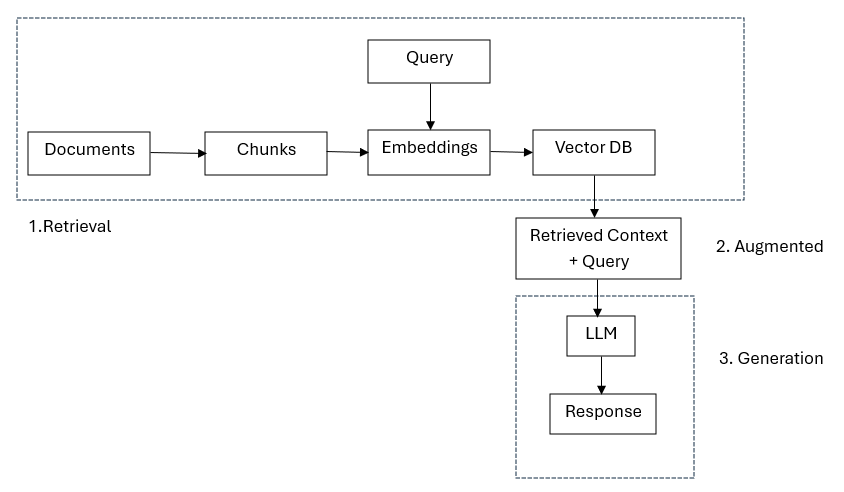

# Agentic RAG Implementation
LLM used: llama-3.3-70b-versatile via Groq API and gemini/gemini-1.5-flash for CrewAI Agent 
Embeddings: sentence-transformers/all-mpnet-base-v2  
Vector DB: FAISS  
Important Libraries: HuggingFace, LangChain, CrewAI  
Demo Deployment: https://agentic-rag5471.streamlit.app/

# Flow

1. Retrieval (Optional) 
Just like Traditional RAG, documents are chunked and embedded into a Vector DB.
A query is embedded and compared to these chunks for similarity.

2. Decision Making  
LLM determines if the local context (vector DB) is sufficient to answer the query. 
If YES → use local context from the vector DB. 
If NO → trigger CrewAI Agent to perform web search via Serper and web scraping to extract content.  
This is the key upgrade from traditional RAG — it allows adaptive behavior based on the query type.

3. Augmentation  
If local retrieval is used: query + retrieved chunks → augmented prompt. 
If web info is used: query + web-extracted content → augmented prompt.

4. Generation 
The final LLM receives the full augmented input (from local or external source) and return grounded response.

# Difference between traditional RAG and Agentic RAG
 

**Traditional RAG flow**

1. Flexibility  
   Traditional RAG always retrieves from Vector DB but Agentic RAG retrieves from Vector DB only when needed.
2. Extra Searches  
   Traditional RAG searches in local content unless setup multi source RAG. Agentic RAG searches from web based on LLM decision. Therefore, Agentic RAG provides dynamic knowledge base.
3. Query Handling  
   Agentic RAG excels in handling complex queries by coordinating multiple sub-tasks through agents. This orchestration allows for thorough exploration of topics, resulting in well-rounded answers.

